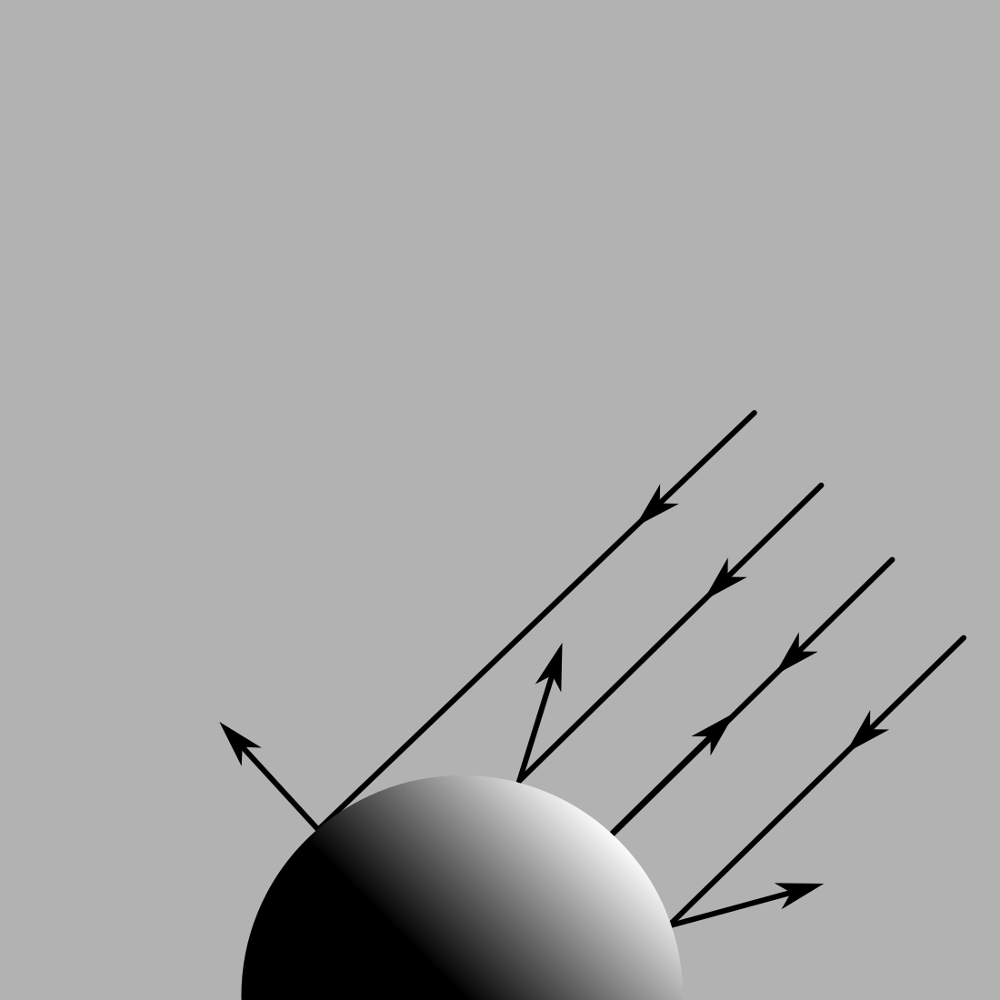

{:width="450" .invertable}

Phong Lighting Model:
---
Phong lighting model is a simplest approximation of surface lighting. It is not physically correct and just mimic like light is works.

It uses dot product to model light intensity, relative to light direction and surface's normal.

Geometrically, dot product looks like this:

```math
a.b = ‖a‖·‖b‖·cos(θ)
```

where `‖a‖` is a magnitude of a vector `a`, and `θ` is an angle between vectors `a` and `b`. In case of graphics, direction vectors are normalized, it means that magnitude is equal to **one**.
Simply we get, that dot product of normalized vectors is equals to `cos(θ)`.

This is how `cos(θ)` plot looks in range `[-π; π]` in radians or `[-180; 180]` in degrees:

<div class="invertable">
    <iframe src="https://www.desmos.com/calculator/k1wljac18w?embed" style="border: 5px solid var(--inv-gray-3)" frameborder=0></iframe>
</div>

When light hits the surface perpendicular the angle `θ` between light vector and normal vector comes `0`, and `cos(θ)` comes to it maximum value `1`. When the `θ` is `90`

{:width="400"}

And this is how it looks on a sphere:

<iframe src="https://www.shadertoy.com/embed/DtGfWR?gui=false&t=10&paused=true&muted=true" style="border: 5px solid var(--gray-3)" frameborder="0"></iframe>

And here is an implementation in HLSL:

```hlsl
half3 Phong(half3 normalWS, half3 lightDirectionWS, half3 lightColor)
{
    half NdotL = dot(normalWS, lightDirectionWS);

    // Max with zero is needed to eliminate negative values
    return max(0, NdotL) * lightColor;
}
```

Blinn-Phong Lighting Model:
---

[WIP]

Bling-Phong model is more improved lighting model and it uses view direction vector to create a highlight on a surface to imitate its smoothness.

```hlsl
half3 BlinnPhong(half3 normalWS, half3 viewDirectionWS, half specularPower, half3 lightDirectionWS, half3 lightColor)
{
    // Halfway vector
    half3 h = normalize(lightDirectionWS + viewDirectionWS);
    half NdotH = saturate(dot(normalWS, h));
    half intensity = pow(NdotH, specularPower);

    return lightColor * intensity;
}
```


Example Shader:
---

```hlsl
Shader "AlexMalyutinDev/BlinnPhong"
{
    Properties
    {
        _Color ("Main Color", Color) = (1.0, 1.0, 1.0, 1.0)
        _SpecularPower ("Specular Power", Range(0.01, 10.0)) = 1.0
    }

    SubShader
    {
        Tags
        {
            "RenderType" = "Opaque"
            "RenderPipeline" = "UniversalPipeline"
        }

        Pass
        {
            Name "Phong"
            Tags
            {
                "LightMode" = "UniversalForward"
            }

            HLSLPROGRAM

            #pragma vertex Vertex
            #pragma fragment Fragment

            #include "Packages/com.unity.render-pipelines.core/ShaderLibrary/SpaceTransforms.hlsl"
            #include "Packages/com.unity.render-pipelines.universal/ShaderLibrary/Input.hlsl"
            #include "Packages/com.unity.render-pipelines.universal/ShaderLibrary/ShaderVariablesFunctions.hlsl"

            half4 _Color;
            half _SpecularPower;

            struct Attributes
            {
                float4 positionOS : POSITION;
                float3 normalOS : NORMAL;
            };
            
            struct Varyings
            {
                half3 normalWS : TEXCOORD0;
                half3 viewDirectionWS : TEXCOORD1;
                float4 positionCS : SV_POSITION;
            }

            half3 BlinnPhong(
                half3 normalWS,
                half3 viewDirectionWS,
                half specularPower,
                half3 lightDirectionWS,
                half3 lightColor
            )
            {
                // Halfway vector
                half3 h = normalize(lightDirectionWS + viewDirectionWS);
                half NdotH = saturate(dot(normalWS, h));
                half intensity = pow(NdotH, specularPower);

                return lightColor * intensity;
            }

            Varyings Vertex(Attributes input)
            {
                Varyings output = (Varyings)0;

                float3 positionWS = TransformObjectToWorld(input.positionOS.xyz);
                // viewDirectionWS is a vector from camera position to object surface
                output.viewDirectionWS = GetWorldSpaceNormalizeViewDir(positionWS);
                output.positionCS = TransformWorldToHClip(positionWS);

                output.normalWS = TransformObjectToWorldNormal(input.normalOS.xyz);
            }

            half4 Fragment(Varyings input) : SV_Target
            {
                half4 color = _Color;
                // mainLightDirection is a negative vector of actual light direction
                half3 mainLightDirection = -_MainLightPosition.xyz;

                half3 lighting = BlinnPhong(
                    input.normalWS,
                    -input.viewDirectionWS,
                    _SpecularPower,
                    mainLightDirection,
                    _MainLightColor.rgb
                );

                color.rgb *= lighting;

                return color;
            }

            ENDHLSL
        }
    }
}
```
